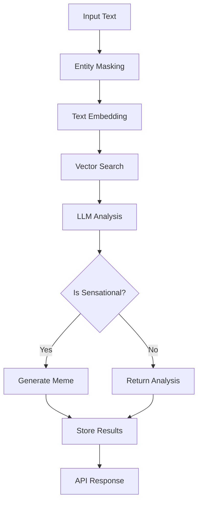

# Detox Pipeline

The Detox Pipeline is a comprehensive system for analyzing and processing news headlines to identify and mitigate sensational or potentially harmful content. It uses NLP, vector search, and LLMs to provide context-aware analysis and generate appropriate responses.

## Features

- **Entity Masking**: Identifies and masks named entities (people, organizations, locations) to focus on content structure
- **Contextual Analysis**: Uses vector embeddings to find similar historical news items
- **LLM-powered Insight**: Generates balanced, fact-based analysis of content
- **Meme Generation**: Automatically creates memes for sensational content to provide perspective
- **API-first Design**: RESTful endpoints for easy integration
- **Asynchronous Processing**: Background task processing for scalability

## Architecture



## API Endpoints

### 1. Process Text

Start processing text through the detox pipeline.

```http
POST /api/detox/process
```

**Request Body:**
```json
{
  "text": "AI takes over the world, says expert John Doe",
  "generate_meme": true
}
```

**Response (202 Accepted):**
```json
{
  "id": "550e8400-e29b-41d4-a716-446655440000",
  "status": "pending",
  "original_text": "AI takes over the world, says expert John Doe"
}
```

### 2. Check Status

Check the status of a detox processing task.

```http
GET /api/detox/status/{detox_id}
```

**Response (200 OK):**
```json
{
  "id": "550e8400-e29b-41d4-a716-446655440000",
  "status": "completed",
  "original_text": "AI takes over the world, says expert John Doe",
  "masked_text": "AI takes over the world, says expert [PERSON_1]",
  "is_sensational": true,
  "confidence": 0.92,
  "meme_task_id": "660e8400-e29b-41d4-a716-446655441111",
  "analysis": "This headline uses alarmist language about AI..."
}
```

## Configuration

Environment variables for the detox pipeline:

```env
# Entity detection
DETOX_ENTITY_TYPES=PERSON,ORG,GPE,LOC,PRODUCT,EVENT,WORK_OF_ART

# Qdrant
DETOX_QDRANT_URL=http://localhost:6333
DETOX_QDRANT_API_KEY=your-api-key
DETOX_QDRANT_COLLECTION=news_embeddings

# Embedding model
DETOX_EMBEDDING_MODEL=sentence-transformers/all-mpnet-base-v2

# Similarity search
DETOX_SIMILARITY_THRESHOLD=0.7
DETOX_MAX_SIMILAR_ITEMS=5

# LLM settings
DETOX_LLM_TEMPERATURE=0.3
DETOX_LLM_MAX_TOKENS=500

# Meme generation
DETOX_ENABLE_MEME_GENERATION=true

# Logging
DETOX_LOG_LEVEL=INFO
```

## Usage Example

```python
import httpx
import asyncio

async def process_headline(headline: str):
    # Start processing
    async with httpx.AsyncClient() as client:
        # Start processing
        response = await client.post(
            "http://localhost:8000/api/detox/process",
            json={"text": headline, "generate_meme": True},
            headers={"Authorization": "Bearer YOUR_JWT_TOKEN"}
        )
        task = response.json()
        
        # Poll for completion
        while True:
            status_response = await client.get(
                f"http://localhost:8000/api/detox/status/{task['id']}",
                headers={"Authorization": "Bearer YOUR_JWT_TOKEN"}
            )
            status = status_response.json()
            
            if status["status"] in ["completed", "error"]:
                return status
                
            await asyncio.sleep(1)

# Example usage
result = asyncio.run(process_headline("AI takes over the world, says expert"))
print(result)
```

## Integration with Meme Generation

When content is flagged as potentially sensational, the pipeline can automatically trigger meme generation. The meme generation task runs asynchronously, and the status can be checked using the `meme_task_id` in the response.

## Error Handling

The API returns appropriate HTTP status codes and error messages:

- `400 Bad Request`: Invalid input data
- `401 Unauthorized`: Missing or invalid authentication
- `403 Forbidden`: Insufficient permissions
- `404 Not Found`: Resource not found
- `429 Too Many Requests`: Rate limit exceeded
- `500 Internal Server Error`: Server-side error

## Testing

Run the test suite with:

```bash
pytest tests/test_detox_pipeline.py -v
```

## Dependencies

- spaCy: For entity recognition
- Sentence Transformers: For text embeddings
- Qdrant: For vector similarity search
- FastAPI: For the API server
- SQLAlchemy: For database operations
- Celery: For background task processing

## Contributing

1. Fork the repository
2. Create a feature branch
3. Commit your changes
4. Push to the branch
5. Create a Pull Request

## License

MIT
